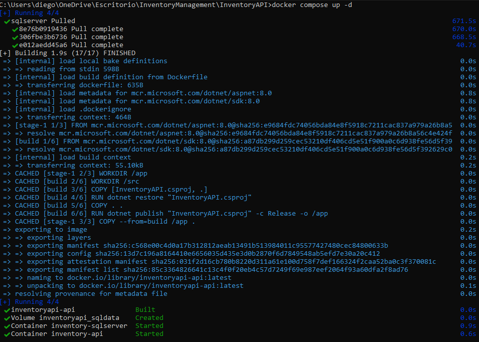
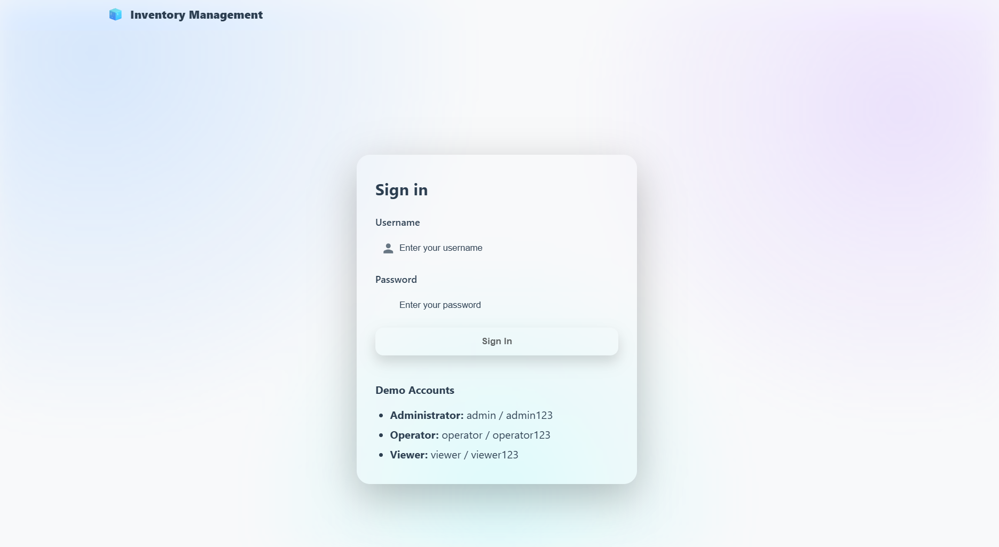
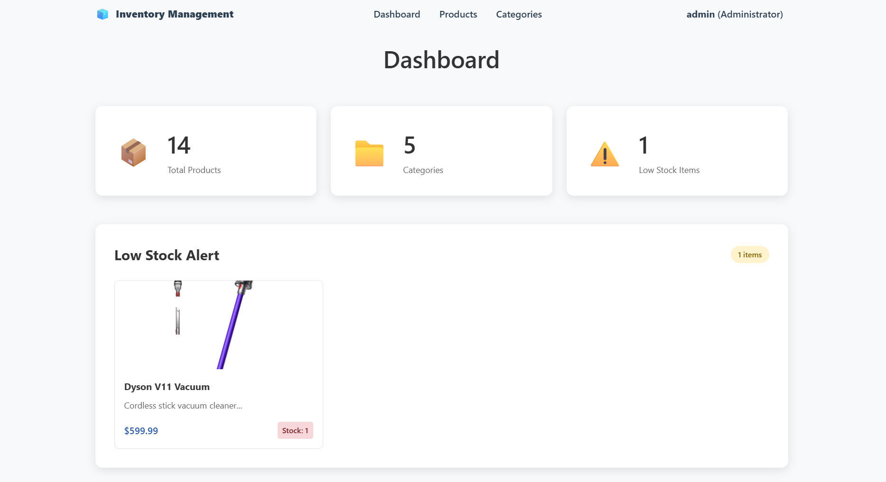
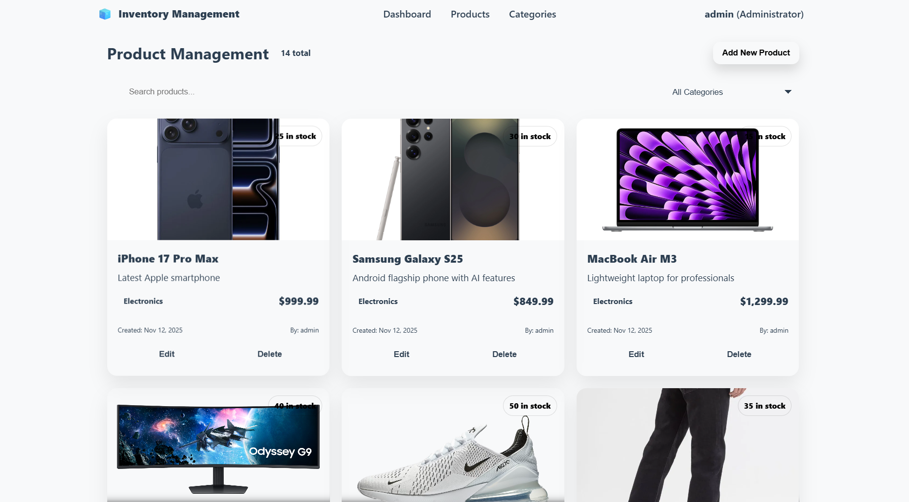
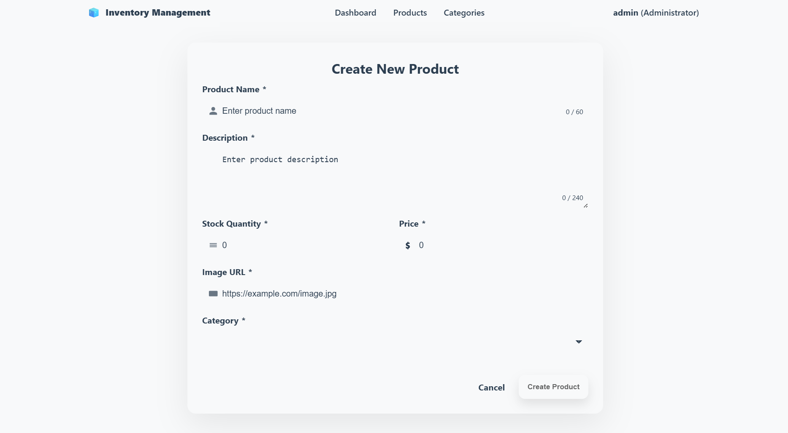
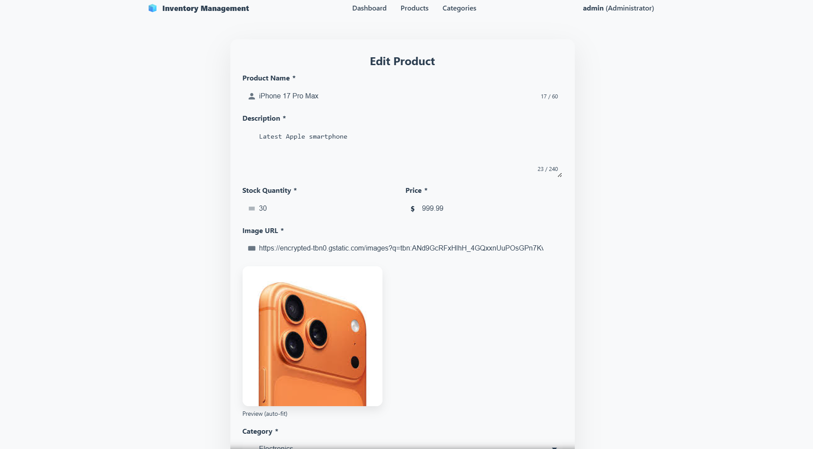
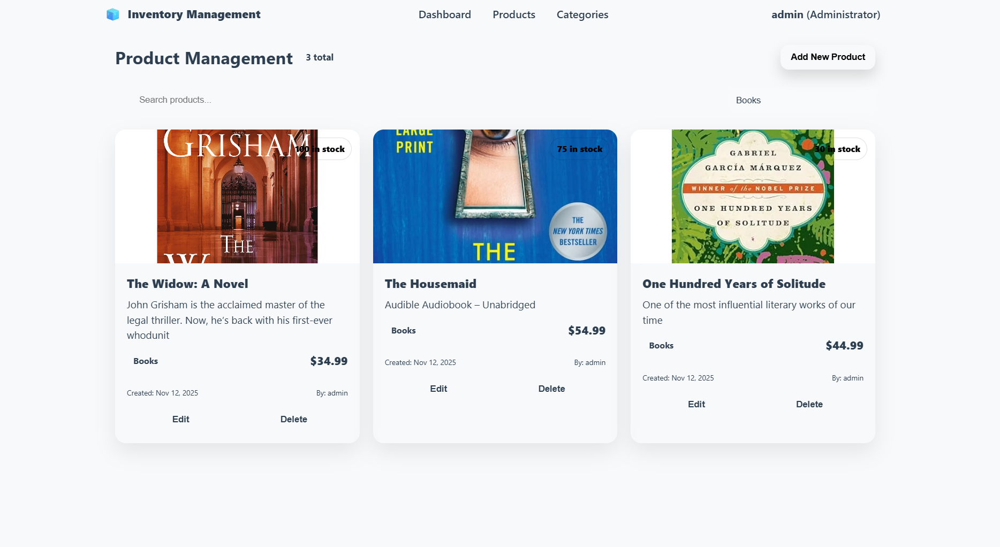
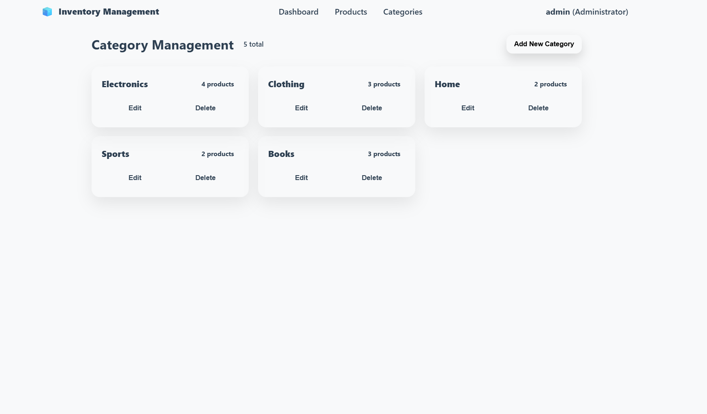
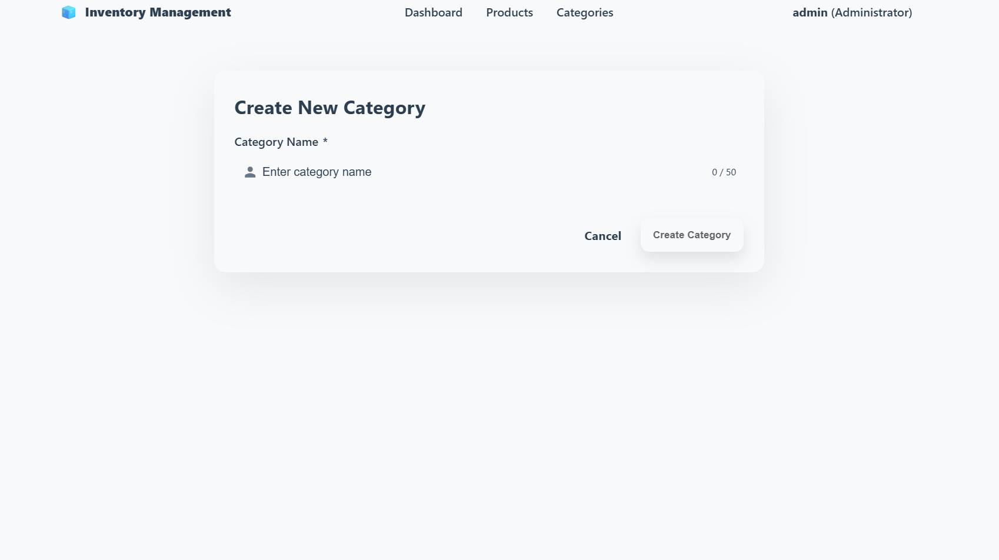

# InventoryManagement

InventoryManagement is a comprehensive solution for managing inventory products. It provides features for adding, updating, deleting, and viewing products in the inventory.

## Features

- Add new products with details such as name, quantity, price, and description.
- Update existing product information.
- Delete products from the inventory.
- View a list of all products in the inventory.
- Search for products by name.
- Filter products based on categories.

## Roles

- Admin: Full access to all features including adding, updating, deleting, and viewing products.
- Operator: Can add and update products but cannot delete them.
- User/Viewer: Can view products and search/filter but cannot add, update, or delete products.

## Installation

1. InventoryAPI (Backend) 

Clone the repository and navigate to the InventoryAPI directory.

With Docker to use SQL Server:

```bash 
docker compose up --build
```

CMD


2. InventoryFrontend (Frontend)

Navigate to the InventoryFrontend directory and install the dependencies:

```bash
npm install
npm start
```
Or
```bash
ng serve -o
```

## Demostration 

Login page:


Dashboard Page:


Inventory Page:


Add Product Page:


Update Product Page:


Category Filter:


Category Page:


Add Category Page:



## Technologies Used

- Backend: SQL Server, C#, .NET ,RESTful API, Swagger
- Frontend: Angular, TypeScript, HTML, CSS
- Authentication: JWT (JSON Web Tokens)
- Containerization: Docker


